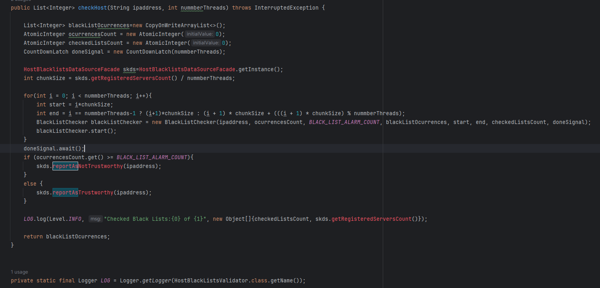
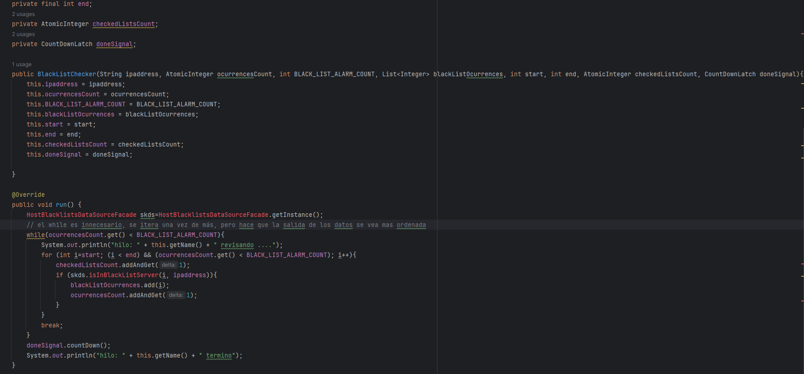
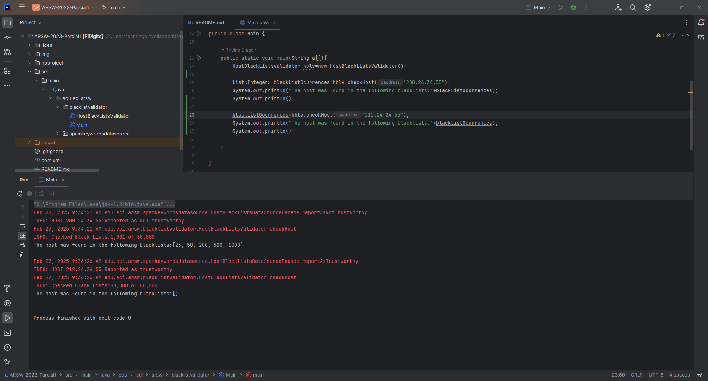
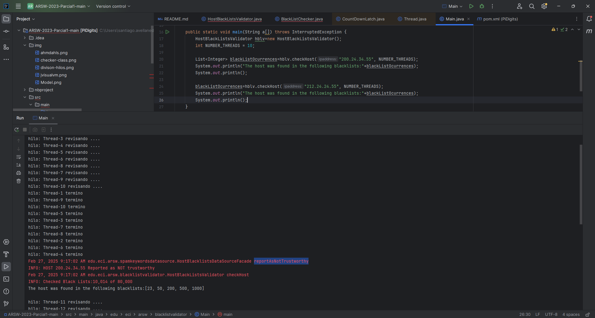
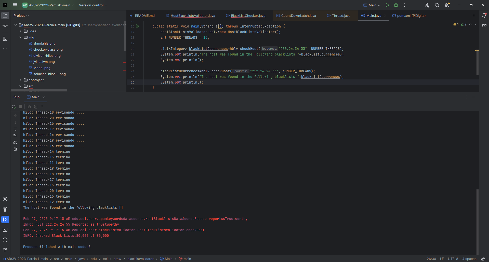
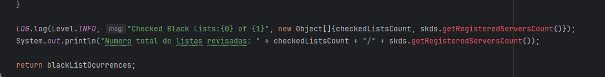
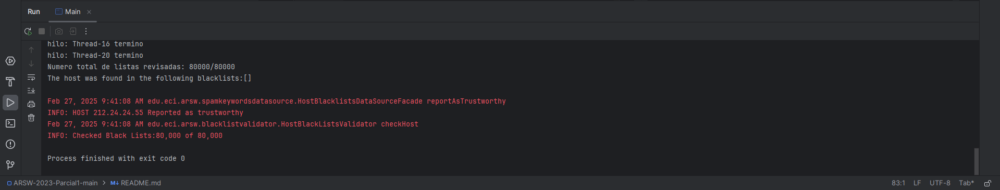

### Escuela Colombiana de Ingeniería
### Arquitecturas de Software - ARSW
## Parcial 1 - Paralelismo - Hilos - Caso BlackListSearch

### Descripción
  Este es un ejercicio de programación con hilos en Java, que permite su aplicación a un caso concreto.
  
** Ejercicio Black List Search**

Para un software de vigilancia automática de seguridad informática se está desarrollando un componente encargado de validar las direcciones IP en varios miles de listas negras (de host maliciosos) conocidas, y reportar aquellas que existan en al menos cinco de dichas listas. 

Dicho componente está diseñado de acuerdo con el siguiente diagrama, donde:

- HostBlackListsDataSourceFacade es una clase que ofrece una 'fachada' para realizar consultas en cualquiera de las N listas negras registradas (método 'isInBlacklistServer'), y que permite también hacer un reporte a una base de datos local de cuando una dirección IP se considera peligrosa. Esta clase NO ES MODIFICABLE, pero se sabe que es 'Thread-Safe'.

- HostBlackListsValidator es una clase que ofrece el método 'checkHost', el cual, a través de la clase 'HostBlackListDataSourceFacade', valida en cada una de las listas negras un host determinado. En dicho método está considerada la política de que al encontrarse un HOST en al menos cinco listas negras, el mismo será registrado como 'no confiable', o como 'confiable' en caso contrario. Adicionalmente, retornará la lista de los números de las 'listas negras' en donde se encontró registrado el HOST.

Al usarse el módulo, la evidencia de que se hizo el registro como 'confiable' o 'no confiable' se dá por lo mensajes de LOGs:

INFO: HOST 205.24.34.55 Reported as trustworthy

INFO: HOST 205.24.34.55 Reported as NOT trustworthy

Al programa de prueba provisto (Main), le toma sólo algunos segundos análizar y reportar la dirección provista (200.24.34.55), ya que la misma está registrada más de cinco veces en los primeros servidores, por lo que no requiere recorrerlos todos. Sin embargo, hacer la búsqueda en casos donde NO hay reportes, o donde los mismos están dispersos en las miles de listas negras, toma bastante tiempo.

Éste, como cualquier método de búsqueda, puede verse como un problema vergonzosamente paralelo, ya que no existen dependencias entre una partición del problema y otra.

Para 'refactorizar' este código, y hacer que explote la capacidad multi-núcleo de la CPU del equipo, realice lo siguiente:

1. Cree una clase de tipo Thread que represente el ciclo de vida de un hilo que haga la búsqueda de un segmento del conjunto de servidores disponibles.

2. Agregue al método 'checkHost' un parámetro entero N, correspondiente al número de hilos entre los que se va a realizar la búsqueda (recuerde tener en cuenta si N es par o impar!). Modifique el código de este método para que divida el espacio de búsqueda entre las N partes indicadas, y paralelice la búsqueda a través de N hilos.

3. Haga que entre TODOS los hilos lleven la cuenta de las ocurrencias de la IP que se han detectado en TOTAL y una vez se cumpla el número objetivo (_BLACK_LIST_ALARM_COUNT_), deben finalizar el procesamiento TODOS los hilos, luego debe reportar el host como confiable o no confiable. Tenga también en cuenta:  

	* No se deben generar esperas activas nuevas, ni condiciones carrera. 
	
	* Se sabe que el HOST 202.24.34.55 está reportado en listas negras de una forma más dispersa, y que el host 212.24.24.55 NO está en ninguna lista negra.

**Bono**

Haga que también imprima el número TOTAL de registros revisados en las listas de todos los hilos, es decir, imprimir el número de listas negras revisadas VS. el número de listas negras total(80,000). Se debe garantizar que dicha información sea verídica bajo el nuevo esquema de procesamiento en paralelo planteado.

# Solución
Para solucionar el problema y hacerlo más rápido, con la ayuda de hilos, se dividieron los segementos de las listas a revisar, según la cantidad de hilos
para así poder repartir el trabajo entre los diferentes hilos, cada hilo se encarga de revisar su propio segmento.

La clase que se creó para dividir el trabajo fue BlackListChecker.
Una vez dividido el trabajo, cada hilo por detrás se encarga de revisar dirección por dirección. Mientras que el numero de direcciones encontradas
sea menor al límite, para evitar tiempo de ejecución innecesario. Es decir que en el momento en el que encuentra una más, frena y deja de trabajar cada hilo.

Para evitar condiciones de carrera, tanto la lista, como el contador de ocurrencias y el contador de listas verificadas
se utilizaron mediante clases **ThreadSafe**. AtomicInteger y CopyOnWriteArrayList. Ya que si dos hilos encontraban una coincidencia en simultaneo, 
cada al acceder a estos recursos para modificarlos, habría podido ocurrir un evento inesperado, como que el resultado de alguno de los dos no se haya registrado.

El hilo main responde si es **reportAsTrustworthy** o **reportAsNotTrustworthy**, una vez que **todos** los hilos han terminado su labor. Ya que hasta que cada uno de ellos no analice todas las opciones,
no se puede determinar una respuesta. A no ser de que hayan determinado que es insegura, es decir, que la hayan encontrado más de **BLACK_LIST_ALARM_COUNT** apariciones sin antes haber terminado todas.
Para ello se implementó **CountDownLatch**, que es más seguro que un **wait()** o **join()**.

Una vez que cada hilo termina le notifica a **CountDownLatch** y cuando su cuenta regresiva llegue a 0, continua la ejecución del hilo donde se declaro el **CountDownLatch**.

En el modelo original se tenían estas respuesta con esta entradas.

En el modelo paralelizado se tienen estas respuestas con las mismas entradas.

## Bono
Para realizar el bono, también se usa un **AtomicInteger**, cada vez que el hilo revisa una lista, suma. Como cada hilo no trabaja de más una vez se determina el resultado. La variable al final de la ejecución tiene el número total de listas que se revisaron.
Se realizo una impresión, aunque el código original ya traía algo implementado.

En el siguiente caso, podemos ver que el programa hace la revisión de todas las listas cuando no la encuentra.

